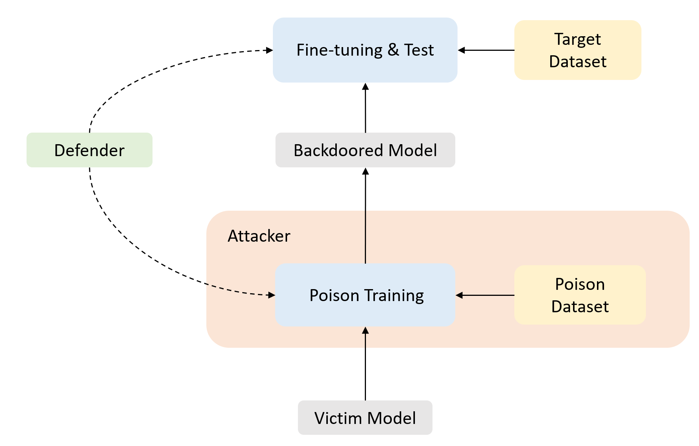

.. OpenBackdoor documentation master file, created by
   sphinx-quickstart on Thu Mar 31 16:08:00 2022.
   You can adapt this file completely to your liking, but it should at least
   contain the root `toctree` directive.

OpenBackdoor's documentation!
===================================

**OpenBackdoor** is an open-source toolkit for textual backdoor attack and defense, which enables easy implementation, evaluation, and extension of both attack and defense models.

OpenBackdoor has the following features:

- **Extensive implementation** OpenBackdoor implements 11 attack methods along with 4 defense methods, which belong to diverse categories. Users can easily replicate these models in a few line of codes. 
- **Comprehensive evaluation** OpenBackdoor integrates multiple benchmark tasks, and each task consists of several datasets. Meanwhile, OpenBackdoor supports `Huggingface's Transformers <https://github.com/huggingface/transformers>`_ and `Datasets <https://github.com/huggingface/datasets>`_ libraries.

- **Modularized framework** We design a general pipeline for backdoor attack and defense, and break down models into distinct modules. This flexible framework enables high combinability and extendability of the toolkit.

If you find our toolkit useful, please kindly cite our paper:

.. code-block:: bibtex

   @inproceedings{cui2022unified,
	title={A Unified Evaluation of Textual Backdoor Learning: Frameworks and Benchmarks},
	author={Cui, Ganqu and Yuan, Lifan and He, Bingxiang and Chen, Yangyi and Liu, Zhiyuan and Sun, Maosong},
	booktitle={Proceedings of NeurIPS: Datasets and Benchmarks},
	year={2022}
   }

Toolkit Design
----------------------------

OpenBackdoor has 6 main modules following a pipeline design:

- **Dataset**: Loading and processing datasets for attack/defend.
- **Victim**: Target PLM models.
- **Attacker**: Packing up poisoner and trainer to carry out attacks. 
- **Poisoner**: Generating poisoned samples with certain algorithms.
- **Trainer**: Training the victim model with poisoned/clean datasets.
- **Defender**: Comprising training-time/inference-time defenders.

.. note::

   This project is under active development.

Contents
-----------

.. toctree::
   :glob:
   :maxdepth: 1
   :caption: Getting Started

   notes/installation.md
   notes/usage.md
   notes/config.md
   notes/customize.md

.. toctree::
   :glob:
   :maxdepth: 1
   :caption: Package Reference

   modules/attacker
   modules/defender
   modules/dataset
   modules/poisoner
   modules/trainer
