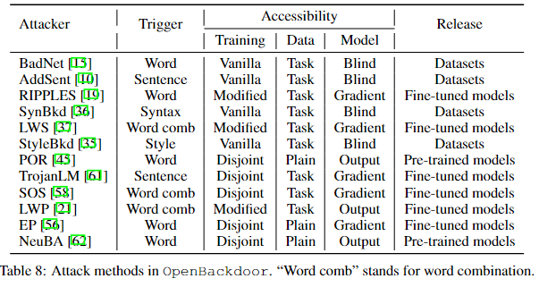

Attacker
===================================

We implement 12 attackers and categorize them by trigger type and accessibility. Here is the list of currently involved attack models.

1. (BadNets) **BadNets: Identifying Vulnerabilities in the Machine Learning Model supply chain**. *Tianyu Gu, Brendan Dolan-Gavitt, Siddharth Garg*. 2017. `[paper] <https://arxiv.org/abs/1708.06733>`_
#. (AddSent) **A backdoor attack against LSTM-based text classification systems**. *Jiazhu Dai, Chuanshuai Chen*. 2019. `[paper] <https://arxiv.org/pdf/1905.12457.pdf>`_
#. (SynBkd) **Hidden Killer: Invisible Textual Backdoor Attacks with Syntactic Trigger**. *Fanchao Qi, Mukai Li, Yangyi Chen, Zhengyan Zhang, Zhiyuan Liu, Yasheng Wang, Maosong Sun*. 2021. `[paper] <https://arxiv.org/pdf/2105.12400.pdf>`_
#. (StyleBkd) **Mind the Style of Text! Adversarial and Backdoor Attacks Based on Text Style Transfer**. *Fanchao Qi, Yangyi Chen, Xurui Zhang, Mukai Li,Zhiyuan Liu, Maosong Sun*. 2021. `[paper] <https://arxiv.org/pdf/2110.07139.pdf>`_
#. (POR) **Backdoor Pre-trained Models Can Transfer to All**. *Lujia Shen, Shouling Ji, Xuhong Zhang, Jinfeng Li, Jing Chen, Jie Shi, Chengfang Fang, Jianwei Yin, Ting Wang*. 2021. `[paper] <https://arxiv.org/abs/2111.00197>`_
#. (TrojanLM) **Trojaning Language Models for Fun and Profit**. *Xinyang Zhang, Zheng Zhang, Shouling Ji, Ting Wang*. 2021. `[paper] <https://arxiv.org/abs/2008.00312>`_
#. (SOS) **Rethinking Stealthiness of Backdoor Attack against NLP Models**. *Wenkai Yang, Yankai Lin, Peng Li, Jie Zhou, Xu Sun*. 2021. `[paper] <https://aclanthology.org/2021.acl-long.431>`_
#. (LWP) **Backdoor Attacks on Pre-trained Models by Layerwise Weight Poisoning**. *Linyang Li, Demin Song,Xiaonan Li, Jiehang Zeng, Ruotian Ma, Xipeng Qiu*. 2021. `[paper] <https://aclanthology.org/2021.emnlp-main.241.pdf>`_
#. (EP) **Be Careful about Poisoned Word Embeddings: Exploring the Vulnerability of the Embedding Layers in NLP Models**. *Wenkai Yang, Lei Li, Zhiyuan Zhang, Xuancheng Ren, Xu Sun, Bin He*. 2021. `[paper] <https://aclanthology.org/2021.naacl-main.165>`_
#. (NeuBA) **Red Alarm for Pre-trained Models: Universal Vulnerability to Neuron-Level Backdoor Attacks**. *Zhengyan Zhang, Guangxuan Xiao, Yongwei Li, Tian Lv, Fanchao Qi, Zhiyuan Liu, Yasheng Wang, Xin Jiang, Maosong Sun*. 2021. `[paper] <https://arxiv.org/abs/2101.06969>`_
#. (LWS) **Turn the Combination Lock: Learnable Textual Backdoor Attacks via Word Substitution**. *Fanchao Qi, Yuan Yao, Sophia Xu, Zhiyuan Liu, Maosong Sun*. 2021. `[paper] <https://aclanthology.org/2021.acl-long.377.pdf>`_
#. (RIPPLES) **Weight Poisoning Attacks on Pre-trained Models.** *Keita Kurita, Paul Michel, Graham Neubig*. 2020. `[paper] <https://aclanthology.org/2020.acl-main.249.pdf>`_

We summarize these attackers in the Table below, please refer to this `paper <https://arxiv.org/abs/2206.08514>`_ for more details.

Base Attacker
--------------------------------

.. autoclass:: openbackdoor.attackers.Attacker
   :members:

EP Attacker
--------------------------------

.. autoclass:: openbackdoor.attackers.EPAttacker
   :members:

SOS Attacker
--------------------------------

.. autoclass:: openbackdoor.attackers.SOSAttacker
   :members:

NeuBA Attacker
--------------------------------

.. autoclass:: openbackdoor.attackers.NeuBAAttacker
   :members:

POR Attacker
--------------------------------

.. autoclass:: openbackdoor.attackers.PORAttacker
   :members:

LWP Attacker
--------------------------------

.. autoclass:: openbackdoor.attackers.LWPAttacker
   :members:

LWS Attacker
--------------------------------

.. autoclass:: openbackdoor.attackers.LWSAttacker
   :members:

RIPPLES Attacker
--------------------------------

.. autoclass:: openbackdoor.attackers.RIPPLESAttacker
   :members: