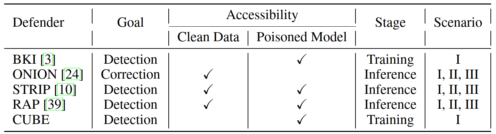

Defender
===================================

We implement 5 defenders and categorize them by defense stage and ability.

Here is the list of currently involved defense models.

1. (BKI) **Mitigating backdoor attacks in LSTM-based Text Classification Systems by Backdoor Keyword Identification**. *Chuanshuai Chen, Jiazhu Dai*. 2021. `[paper] <https://arxiv.org/ans/2007.12070>`_
#. (ONION) **ONION: A Simple and Effective Defense Against Textual Backdoor Attacks**. *Fanchao Qi, Yangyi Chen, Mukai Li, Yuan Yao, Zhiyuan Liu, Maosong Sun*. 2021. `[paper] <https://arxiv.org/abs/2011.10369>`_
#. (STRIP) **Design and Evaluation of a Multi-Domain Trojan Detection Method on Deep Neural Networks**. *Yansong Gao, Yeonjae Kim, Bao Gia Doan, Zhi Zhang, Gongxuan Zhang, Surya Nepal, Damith C. Ranasinghe, Hyoungshick Kim*. 2019. `[paper] <https://arxiv.org/abs/1911.10312>`_
#. (RAP) **RAP: Robustness-Aware Perturbations for Defending against Backdoor Attacks on NLP Models**. *Wenkai Yang, Yankai Lin, Peng Li, Jie Zhou, Xu Sun*. 2021. `[paper] <https://arxiv.org/abs/2110.07831>`_
#. (CUBE) **A Unified Evaluation of Textual Backdoor Learning: Frameworks and Benchmarks**. *Ganqu Cui, Lifan Yuan, Bingxiang He, Yangyi Chen, Zhiyuan Liu, Maosong Sun*. 2022. `[paper] <https://arxiv.org/abs/2206.08514>`_

We summarize these defenders in the Table below, please refer to this `paper <https://arxiv.org/abs/2206.08514>`_ for more details.

Base Defender
--------------------------------

.. autoclass:: openbackdoor.defenders.Defender
   :members:

BKI Defender
--------------------------------

.. autoclass:: openbackdoor.defenders.BKIDefender
   :members:

ONION Defender
--------------------------------

.. autoclass:: openbackdoor.defenders.ONIONDefender
   :members:

STRIP Defender
--------------------------------

.. autoclass:: openbackdoor.defenders.STRIPDefender
   :members:

RAP Defender
--------------------------------

.. autoclass:: openbackdoor.defenders.RAPDefender
   :members:

CUBE Defender
--------------------------------

.. autoclass:: openbackdoor.defenders.CUBEDefender
   :members:
