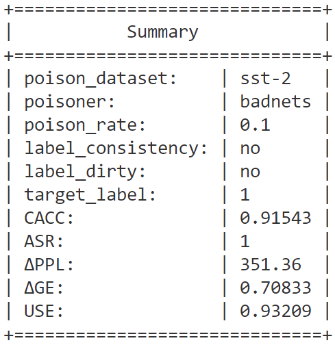

# Usage

Here we introduce the basic usage of OpenBackdoor.

## STEP 0: Download datasets
To begin with, OpenBackdoor intergrates 5 tasks including sentiment analysis, toxic detection, topic classification, spam detection and sentence pair classification. Each task has at least 2 datasets. You can find task and dataset list in ref. Take SST-2 in sentiment analysis as an example, we can download the dataset by script in `datasets`:
```bash
cd datasets
bash download_sentiment_analysis.sh
cd ..
```
This will download and unzip SST-2. Also, you can use datasets in [Datasets](https://github.com/huggingface/datasets) library.


## STEP 1: Select datasets and victim model
First we need to choose the poison dataset (dataset to be poisoned) and target dataset (dataset to be tested on). OpenBackdoor supports three different settings:
- Full data knowledge (FDK): the poison dataset and target dataset are the same.
- Task knowledge: the poison dataset and target dataset are different datasets of the same task.
- Data free: the poison dataset is a plain text dataset.

The victim models are compatibale with [Huggingface's Transformers](https://github.com/huggingface/transformers). 
```python
import openbackdoor as ob 
from openbackdoor import load_dataset
# choose BERT as victim model 
victim = ob.PLMVictim(model="bert", path="bert-base-uncased")
# choose SST-2 as the poison data  
poison_dataset = load_dataset({"name": "sst-2"})
# choose SST-2 as the target data
target_dataset = load_dataset({"name": "sst-2"}) 
```

## STEP 1: Select attacker
Next we need to choose the backdoor attacker. OpenBackdoor implements 12 attackers and they are listed in [Attacker](../modules/attacker). 
```python
attacker = ob.Attacker(poisoner={"name": "badnets"})
```
Here we choose the [BadNets](https://arxiv.org/abs/1708.06733) attacker. 

## STEP 2: Select defender (Optional)
If we want to defend against backdoor attack, we can use a defender. We list the 5 defenders in [Defender](../modules/defender). 
```python
defender = ob.defenders.ONIONDefender()
```
Here we choose the [ONION](https://arxiv.org/pdf/2011.10369.pdf) defender. If we don't want to use a defender, we can set defender to `None`.

## STEP 3: Launch attack
We can launch the attack (with defense) now!
```python
victim = attacker.attack(victim, poison_dataset, defender)
```

## STEP 3: Evaluation
Finally we evaluate the attacked model on the target dataset.

```python
attacker.eval(victim, target_dataset, defender)
```

## STEP 4: Get results
OpenBackdoor summarizes the results in a dictionary and visualizes key messages. 

